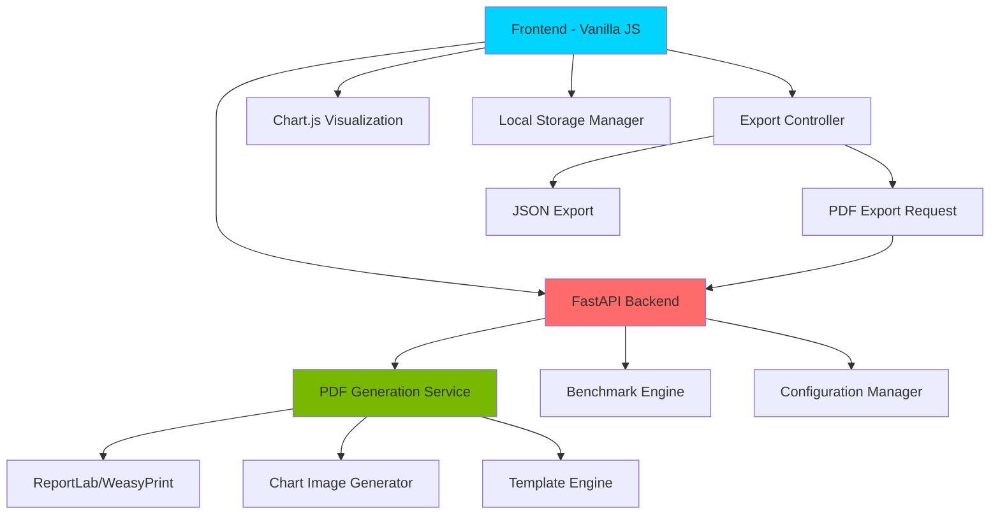
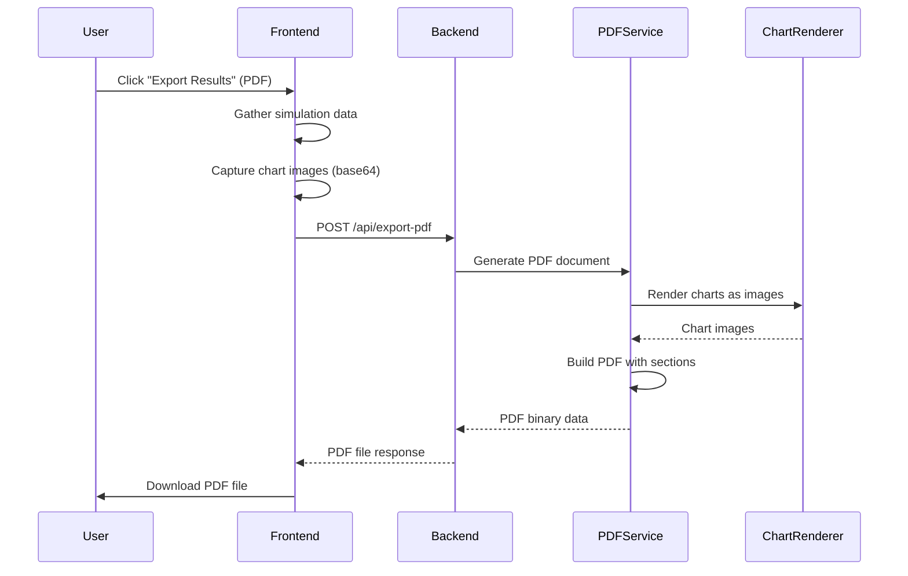
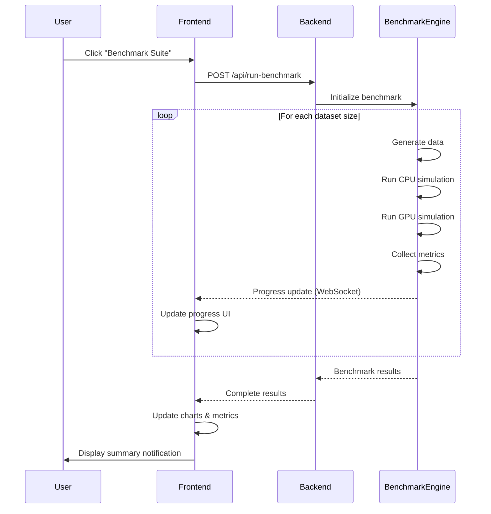

# Design Document: Enhanced Simulation Features

## Overview

This design extends the GPU Quantum Compute Simulator web application with professional reporting capabilities and complete UI functionality. The core enhancement is a PDF export system that generates technical reports containing performance metrics, charts, thread block visualizations, and execution logs. Additionally, this design implements missing UI features including quick action buttons (Benchmark Suite, Auto Optimize), configuration management (Reset, Save Preset), console controls (Clear, Export Log), and analytics tab switching.

The system maintains the existing vanilla JavaScript frontend and FastAPI backend architecture while adding PDF generation capabilities on the server side and enhanced client-side interactivity. The design prioritizes professional document formatting, seamless user experience, and maintainability.

## Architecture



## Sequence Diagrams

### PDF Export Flow



### Benchmark Suite Flow



## Components and Interfaces

### Component 1: PDF Export Service (Backend)

**Purpose**: Generate professional PDF reports containing simulation results, charts, and visualizations

**Interface**:
```python
class PDFExportService:
    def generate_report(
        self,
        simulation_data: SimulationData,
        chart_images: Dict[str, bytes],
        thread_viz_image: bytes,
        console_logs: List[str]
    ) -> bytes:
        """Generate complete PDF report"""
        pass
    
    def render_performance_section(
        self,
        pdf: Canvas,
        metrics: PerformanceMetrics
    ) -> None:
        """Render performance metrics section"""
        pass
    
    def render_chart_section(
        self,
        pdf: Canvas,
        chart_image: bytes,
        title: str
    ) -> None:
        """Render chart visualization section"""
        pass
    
    def render_thread_visualization(
        self,
        pdf: Canvas,
        thread_image: bytes,
        thread_info: ThreadBlockInfo
    ) -> None:
        """Render thread block visualization"""
        pass
    
    def render_execution_logs(
        self,
        pdf: Canvas,
        logs: List[str]
    ) -> None:
        """Render console execution logs"""
        pass
```

**Responsibilities**:
- Generate multi-page PDF documents with proper formatting
- Embed chart images and visualizations
- Format performance metrics in tables
- Include branding and professional styling
- Handle page breaks and layout management

### Component 2: Chart Image Capture (Frontend)

**Purpose**: Convert Chart.js visualizations to base64 images for PDF embedding

**Interface**:
```javascript
class ChartImageCapture {
    captureChart(chartId: string): Promise<string> {
        // Returns base64 encoded image
    }
    
    captureThreadVisualization(): Promise<string> {
        // Captures thread block grid as image
    }
    
    captureAllCharts(): Promise<ChartImages> {
        // Captures all active charts
    }
}

interface ChartImages {
    timeChart: string;
    speedupChart: string;
    efficiencyChart: string;
    threadVisualization: string;
}
```

**Responsibilities**:
- Convert canvas elements to base64 PNG images
- Capture thread block visualization DOM as image
- Handle high-resolution image generation
- Manage async image capture operations

### Component 3: Benchmark Engine (Backend)

**Purpose**: Execute automated benchmark suite across multiple dataset sizes

**Interface**:
```python
class BenchmarkEngine:
    def run_benchmark_suite(
        self,
        operations: List[str],
        dataset_sizes: List[int],
        progress_callback: Optional[Callable] = None
    ) -> BenchmarkResults:
        """Run comprehensive benchmark across configurations"""
        pass
    
    def run_single_benchmark(
        self,
        operation: str,
        dataset_size: int
    ) -> BenchmarkResult:
        """Execute single benchmark test"""
        pass
    
    def analyze_benchmark_results(
        self,
        results: List[BenchmarkResult]
    ) -> BenchmarkAnalysis:
        """Analyze and summarize benchmark data"""
        pass
```

**Responsibilities**:
- Execute simulations across multiple configurations
- Collect performance metrics systematically
- Provide progress updates during execution
- Generate statistical analysis of results
- Detect performance anomalies

### Component 4: Configuration Manager (Frontend + Backend)

**Purpose**: Save and restore simulation configuration presets

**Interface**:
```javascript
class ConfigurationManager {
    savePreset(name: string, config: SimulationConfig): void {
        // Save to localStorage
    }
    
    loadPreset(name: string): SimulationConfig | null {
        // Load from localStorage
    }
    
    listPresets(): string[] {
        // List all saved presets
    }
    
    deletePreset(name: string): void {
        // Remove preset
    }
    
    resetToDefault(): SimulationConfig {
        // Reset to default configuration
    }
}

interface SimulationConfig {
    datasetSize: number;
    operation: string;
    numProcesses?: number;
}
```

**Responsibilities**:
- Persist configuration presets to browser storage
- Restore saved configurations
- Manage preset lifecycle (create, read, delete)
- Provide default configuration reset

### Component 5: Export Controller (Frontend)

**Purpose**: Coordinate export operations for JSON and PDF formats

**Interface**:
```javascript
class ExportController {
    async exportJSON(): Promise<void> {
        // Export results as JSON file
    }
    
    async exportPDF(): Promise<void> {
        // Export results as PDF report
    }
    
    async prepareExportData(): Promise<ExportData> {
        // Gather all data for export
    }
    
    downloadFile(blob: Blob, filename: string): void {
        // Trigger browser download
    }
}

interface ExportData {
    simulationData: SimulationData;
    performanceHistory: PerformanceRecord[];
    chartImages: ChartImages;
    consoleLogs: string[];
    timestamp: string;
}
```

**Responsibilities**:
- Coordinate data collection from multiple sources
- Capture chart images for PDF export
- Handle file download triggers
- Manage export format selection
- Provide user feedback during export

### Component 6: Analytics Tab Manager (Frontend)

**Purpose**: Handle switching between Metrics and Compare analytics views

**Interface**:
```javascript
class AnalyticsTabManager {
    switchTab(tabName: string): void {
        // Switch between tabs
    }
    
    renderMetricsView(data: PerformanceMetrics): void {
        // Display metrics cards
    }
    
    renderCompareView(history: PerformanceRecord[]): void {
        // Display comparison table
    }
    
    updateActiveTab(tabName: string): void {
        // Update UI state
    }
}
```

**Responsibilities**:
- Manage tab state and visibility
- Render appropriate content for each tab
- Handle tab switching animations
- Update active tab indicators

## Data Models

### SimulationData

```python
class SimulationData(BaseModel):
    dataset_size: int
    operation: str
    cpu_execution_time: float
    gpu_execution_time: float
    speedup_ratio: float
    efficiency_percentage: float
    throughput: int
    thread_block_info: ThreadBlockInfo
    timestamp: datetime
```

**Validation Rules**:
- dataset_size must be positive integer
- execution times must be positive floats
- speedup_ratio must be >= 1.0
- efficiency_percentage must be 0-100

### BenchmarkResults

```python
class BenchmarkResult(BaseModel):
    operation: str
    dataset_size: int
    cpu_time: float
    gpu_time: float
    speedup: float
    timestamp: datetime

class BenchmarkResults(BaseModel):
    results: List[BenchmarkResult]
    total_tests: int
    average_speedup: float
    best_speedup: float
    worst_speedup: float
    total_duration: float
```

**Validation Rules**:
- results list must not be empty
- total_tests must equal len(results)
- average_speedup must be calculated correctly
- total_duration must be positive

### PDFReportRequest

```python
class PDFReportRequest(BaseModel):
    simulation_data: SimulationData
    chart_images: Dict[str, str]  # base64 encoded
    thread_viz_image: str  # base64 encoded
    console_logs: List[str]
    include_branding: bool = True
    report_title: str = "GPU Quantum Compute Simulation Report"
```

**Validation Rules**:
- chart_images must contain valid base64 strings
- console_logs must be list of strings
- report_title must be non-empty string

### ConfigurationPreset

```javascript
interface ConfigurationPreset {
    name: string;
    datasetSize: number;
    operation: string;
    numProcesses?: number;
    createdAt: string;
    description?: string;
}
```

**Validation Rules**:
- name must be unique and non-empty
- datasetSize must be in supported sizes
- operation must be in supported operations
- createdAt must be valid ISO date string

## Error Handling

### Error Scenario 1: PDF Generation Failure

**Condition**: PDF generation fails due to missing dependencies or invalid data
**Response**: Return HTTP 500 with descriptive error message
**Recovery**: 
- Log detailed error information
- Suggest fallback to JSON export
- Provide user-friendly error notification
- Maintain application state

### Error Scenario 2: Chart Capture Failure

**Condition**: Chart.js canvas cannot be converted to image
**Response**: Display warning notification, continue with available charts
**Recovery**:
- Attempt capture with lower resolution
- Skip failed chart and include placeholder
- Log warning for debugging
- Complete export with partial data

### Error Scenario 3: Benchmark Timeout

**Condition**: Benchmark suite exceeds maximum execution time
**Response**: Cancel remaining tests, return partial results
**Recovery**:
- Save completed benchmark results
- Display partial results to user
- Provide option to retry failed tests
- Log timeout information

### Error Scenario 4: Invalid Configuration Preset

**Condition**: Loaded preset contains invalid or outdated configuration
**Response**: Display validation error, revert to default configuration
**Recovery**:
- Validate all preset fields
- Remove invalid preset from storage
- Notify user of validation failure
- Load default configuration

### Error Scenario 5: Storage Quota Exceeded

**Condition**: localStorage quota exceeded when saving presets
**Response**: Display storage full error
**Recovery**:
- Prompt user to delete old presets
- Provide preset management UI
- Calculate storage usage
- Suggest export to file

## Testing Strategy

### Unit Testing Approach

**Backend Testing**:
- Test PDF generation with mock data
- Verify chart image embedding
- Test benchmark engine with various configurations
- Validate data model serialization
- Test error handling paths

**Frontend Testing**:
- Test chart image capture functionality
- Verify configuration save/load operations
- Test export controller data gathering
- Validate tab switching logic
- Test console log management

**Coverage Goals**: 80% code coverage for critical paths

### Integration Testing Approach

**End-to-End Export Flow**:
- Test complete PDF export from UI to download
- Verify JSON export functionality
- Test benchmark suite execution
- Validate configuration preset lifecycle
- Test error recovery scenarios

**API Integration**:
- Test all new API endpoints
- Verify request/response formats
- Test concurrent export requests
- Validate file download mechanisms

### Manual Testing Checklist

- PDF report visual quality and formatting
- Chart image resolution and clarity
- Thread visualization rendering
- Console log formatting in PDF
- Benchmark progress updates
- Configuration preset management
- Tab switching animations
- Button state management
- Error notification display

## Performance Considerations

**PDF Generation Performance**:
- Target: Generate PDF in < 5 seconds for typical report
- Use efficient image compression for charts
- Implement streaming PDF generation for large reports
- Cache template components

**Chart Image Capture**:
- Use high-resolution canvas capture (2x scale)
- Implement async capture to avoid UI blocking
- Optimize image format (PNG with compression)

**Benchmark Suite Performance**:
- Provide real-time progress updates
- Allow cancellation of long-running benchmarks
- Implement parallel test execution where possible
- Cache dataset generation between tests

**Frontend Performance**:
- Debounce configuration changes
- Lazy load chart images for export
- Minimize DOM manipulation during tab switching
- Use efficient localStorage serialization

## Security Considerations

**PDF Generation Security**:
- Sanitize all user-provided text in reports
- Validate image data before embedding
- Limit PDF file size to prevent DoS
- Implement rate limiting on export endpoints

**Configuration Storage**:
- Validate all preset data before saving
- Sanitize preset names to prevent XSS
- Implement storage quota limits
- Clear sensitive data from presets

**File Download Security**:
- Use Content-Disposition headers correctly
- Validate file MIME types
- Implement CSRF protection on export endpoints
- Sanitize filenames

## Dependencies

**Backend Dependencies**:
- `reportlab` or `weasyprint`: PDF generation library
- `Pillow`: Image processing for chart embedding
- `matplotlib` (optional): Alternative chart rendering
- Existing: `fastapi`, `pydantic`, `uvicorn`

**Frontend Dependencies**:
- `html2canvas` (optional): DOM to image conversion
- Existing: `Chart.js`, vanilla JavaScript
- No additional npm packages required

**System Dependencies**:
- Python 3.8+
- Modern browser with Canvas API support
- Sufficient disk space for temporary PDF files
