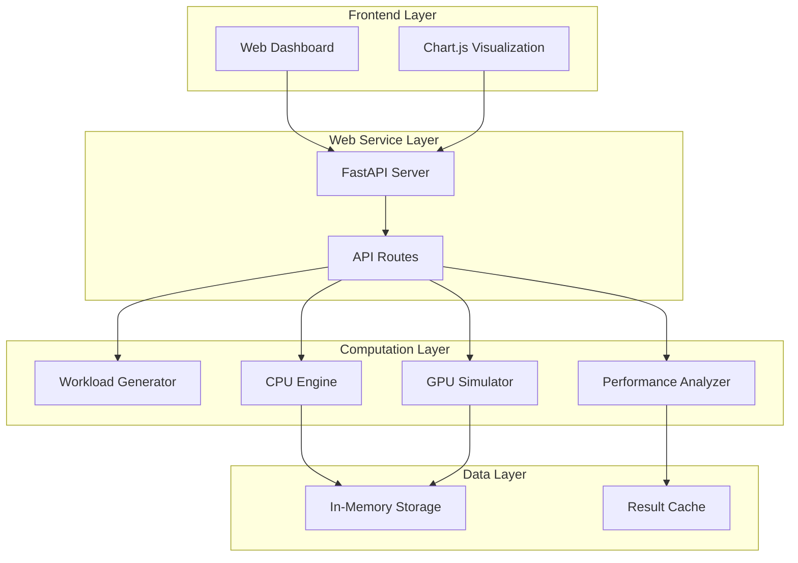

# Design Document: GPU Parallel Floating-Point Simulator

## Overview

The GPU Parallel Floating-Point Simulator is a Python-based educational web application that demonstrates parallel computing concepts by simulating GPU-style execution using multiprocessing. The system provides a comparative analysis between sequential CPU execution and parallel GPU simulation for floating-point operations, helping students understand thread blocks, parallel execution patterns, and performance characteristics.

The application consists of a FastAPI backend that handles computation engines and a single-page web frontend that provides an interactive dashboard for controlling simulations and visualizing results. The simulator uses Python's multiprocessing module to create worker processes that mimic GPU thread blocks, processing data chunks in parallel to demonstrate speedup benefits.

## Architecture

The system follows a layered architecture with clear separation between computation, web service, and presentation layers:



### Component Responsibilities

- **Web Dashboard**: Single-page interface for user interaction and result display
- **FastAPI Server**: RESTful API handling simulation requests and serving static content
- **Workload Generator**: Creates floating-point datasets of specified sizes
- **CPU Engine**: Sequential execution engine for baseline performance measurement
- **GPU Simulator**: Parallel execution engine using multiprocessing to simulate thread blocks
- **Performance Analyzer**: Metrics calculation and comparison between execution modes

## Components and Interfaces

### Workload Generator

**Purpose**: Generate floating-point datasets for computational operations

**Interface**:
```python
class WorkloadGenerator:
    def generate_dataset(self, size: int) -> np.ndarray
    def generate_matrix_pair(self, size: int) -> Tuple[np.ndarray, np.ndarray]
    def get_supported_sizes(self) -> List[int]
```

**Implementation Details**:
- Uses NumPy random number generation for consistent performance
- Supports dataset sizes: 10K, 50K, 100K, 500K elements
- Generates random float64 values in range [0.0, 1.0]
- Matrix operations use square matrices with dimensions sqrt(size)

### CPU Engine

**Purpose**: Sequential execution of floating-point operations for baseline measurement

**Interface**:
```python
class CPUEngine:
    def vector_add(self, a: np.ndarray, b: np.ndarray) -> Tuple[np.ndarray, float]
    def vector_multiply(self, a: np.ndarray, b: np.ndarray) -> Tuple[np.ndarray, float]
    def dot_product(self, a: np.ndarray, b: np.ndarray) -> Tuple[float, float]
    def matrix_multiply(self, a: np.ndarray, b: np.ndarray) -> Tuple[np.ndarray, float]
```

**Implementation Details**:
- Uses time.perf_counter() for microsecond precision timing
- Implements operations using standard NumPy functions
- Returns both computation result and execution time
- Handles memory management for large datasets

### GPU Simulator

**Purpose**: Parallel execution simulation using multiprocessing to mimic GPU thread blocks

**Interface**:
```python
class GPUSimulator:
    def __init__(self, num_processes: int = None)
    def vector_add_parallel(self, a: np.ndarray, b: np.ndarray) -> Tuple[np.ndarray, float]
    def vector_multiply_parallel(self, a: np.ndarray, b: np.ndarray) -> Tuple[np.ndarray, float]
    def dot_product_parallel(self, a: np.ndarray, b: np.ndarray) -> Tuple[float, float]
    def matrix_multiply_parallel(self, a: np.ndarray, b: np.ndarray) -> Tuple[np.ndarray, float]
    def get_thread_block_info(self) -> Dict[str, Any]
```

**Implementation Details**:
- Uses multiprocessing.Pool for worker process management
- Divides datasets into chunks representing thread blocks
- Each worker process handles one chunk independently
- Combines results from all workers into final output
- Measures total execution time including data distribution and result aggregation

### Performance Analyzer

**Purpose**: Calculate and compare performance metrics between CPU and GPU execution

**Interface**:
```python
class PerformanceAnalyzer:
    def calculate_speedup(self, cpu_time: float, gpu_time: float) -> float
    def analyze_results(self, cpu_result: Tuple, gpu_result: Tuple) -> Dict[str, Any]
    def get_performance_history(self) -> List[Dict[str, Any]]
```

**Implementation Details**:
- Calculates speedup ratio as cpu_time / gpu_time
- Handles edge cases (zero or near-zero execution times)
- Maintains performance history for visualization
- Provides statistical analysis of multiple runs

### FastAPI Web Service

**Purpose**: RESTful API server providing endpoints for simulation control and data retrieval

**Endpoints**:
```python
POST /api/generate-data
POST /api/run-cpu-simulation
POST /api/run-gpu-simulation
GET /api/performance-history
GET /api/thread-block-info
GET / (serves static dashboard)
```

**Implementation Details**:
- Handles CORS for local development
- Validates input parameters and dataset sizes
- Manages concurrent request handling
- Serves static files for the web dashboard

## Data Models

### Dataset Model
```python
@dataclass
class Dataset:
    size: int
    data: np.ndarray
    created_at: datetime
    operation_type: str
```

### Simulation Result Model
```python
@dataclass
class SimulationResult:
    operation: str
    dataset_size: int
    execution_time: float
    result_data: Union[np.ndarray, float]
    timestamp: datetime
    engine_type: str  # 'cpu' or 'gpu'
```

### Performance Metrics Model
```python
@dataclass
class PerformanceMetrics:
    cpu_time: float
    gpu_time: float
    speedup_ratio: float
    dataset_size: int
    operation: str
    num_processes: int
    timestamp: datetime
```

### Thread Block Info Model
```python
@dataclass
class ThreadBlockInfo:
    num_blocks: int
    block_size: int
    total_elements: int
    process_distribution: List[int]
```

### API Request Models
```python
class GenerateDataRequest(BaseModel):
    size: int
    operation_type: str

class SimulationRequest(BaseModel):
    operation: str
    dataset_size: int
    num_processes: Optional[int] = None
```

### API Response Models
```python
class SimulationResponse(BaseModel):
    success: bool
    execution_time: float
    result_summary: str
    performance_metrics: Optional[PerformanceMetrics]

class PerformanceHistoryResponse(BaseModel):
    history: List[PerformanceMetrics]
    summary_stats: Dict[str, float]
```

The data models use Python dataclasses for internal representation and Pydantic models for API serialization, ensuring type safety and validation throughout the system. All floating-point calculations maintain precision appropriate for educational demonstration while avoiding unnecessary computational overhead.

## Correctness Properties

*A property is a characteristic or behavior that should hold true across all valid executions of a system-essentially, a formal statement about what the system should do. Properties serve as the bridge between human-readable specifications and machine-verifiable correctness guarantees.*

### Property 1: Dataset Generation Size Consistency

*For any* supported dataset size (10K, 50K, 100K, 500K), generating a dataset should produce an array with exactly the requested number of elements.

**Validates: Requirements 1.1**

### Property 2: Dataset Generation Type Consistency

*For any* generated dataset, all elements should be floating-point numbers within the valid range [0.0, 1.0].

**Validates: Requirements 1.2**

### Property 3: Dataset Generation Performance

*For any* supported dataset size, generation should complete within 5 seconds.

**Validates: Requirements 1.3**

### Property 4: Dataset Memory Persistence

*For any* generated dataset, the data should remain accessible in memory for subsequent operations without regeneration.

**Validates: Requirements 1.4**

### Property 5: Dual Engine Operation Support

*For any* supported floating-point operation (vector addition, multiplication, dot product, matrix multiplication), both CPU and GPU engines should be able to execute the operation successfully.

**Validates: Requirements 2.5**

### Property 6: Execution Timing Consistency

*For any* computation engine (CPU or GPU), executing an operation should return both the computation result and a positive execution time measurement.

**Validates: Requirements 3.3, 3.4, 4.6**

### Property 7: Large Dataset Handling

*For any* supported dataset size including the maximum (500K elements), both CPU and GPU engines should complete operations without memory overflow or system failure.

**Validates: Requirements 3.5**

### Property 8: CPU-GPU Result Consistency

*For any* floating-point operation and dataset, the computational results from CPU and GPU engines should be mathematically equivalent (within floating-point precision tolerance).

**Validates: Requirements 4.5**

### Property 9: Timing Measurement Precision

*For any* execution time measurement, the value should be reported in seconds with at least 3 decimal places of precision.

**Validates: Requirements 5.1, 5.2**

### Property 10: Speedup Calculation Accuracy

*For any* pair of CPU and GPU execution times, the speedup ratio should equal cpu_time divided by gpu_time.

**Validates: Requirements 5.3**

### Property 11: Speedup Display Precision

*For any* calculated speedup ratio, the displayed value should be formatted with exactly 2 decimal places.

**Validates: Requirements 5.4**

### Property 12: Division by Zero Handling

*For any* performance analysis where GPU execution time is zero or near-zero (< 0.001), the system should handle the division gracefully without throwing exceptions.

**Validates: Requirements 5.5**

## Error Handling

The system implements comprehensive error handling across all components to ensure robust operation in educational environments:

### Dataset Generation Errors
- **Invalid Size Requests**: Reject dataset sizes outside supported range (10K-500K) with clear error messages
- **Memory Allocation Failures**: Handle insufficient memory gracefully with fallback to smaller datasets
- **Random Generation Failures**: Retry with different random seeds if initial generation fails

### Computation Engine Errors
- **Dimension Mismatch**: Validate array dimensions before operations and provide descriptive error messages
- **Numerical Overflow**: Handle floating-point overflow/underflow with appropriate warnings
- **Process Failures**: In GPU simulation, handle worker process crashes by retrying with fewer processes

### Web Service Errors
- **Invalid API Requests**: Validate all input parameters and return structured error responses
- **Concurrent Request Handling**: Prevent multiple simultaneous simulations that could cause resource conflicts
- **Static File Serving**: Handle missing static files with appropriate 404 responses

### Performance Analysis Errors
- **Zero Execution Times**: Handle cases where operations complete too quickly to measure accurately
- **Negative Speedup**: Detect and report cases where parallel execution is slower than sequential
- **Missing Data**: Gracefully handle requests for performance history when no data exists

### Frontend Error Handling
- **Network Failures**: Display user-friendly messages when API calls fail
- **Chart Rendering Errors**: Fallback to text display when Chart.js fails to render
- **Browser Compatibility**: Detect and warn about unsupported browser features

## Testing Strategy

The testing strategy employs a dual approach combining unit tests for specific functionality and property-based tests for comprehensive validation of system behavior across all input ranges.

### Unit Testing Approach

Unit tests focus on specific examples, integration points, and edge cases:

- **Component Integration**: Test interactions between workload generator, engines, and performance analyzer
- **API Endpoint Validation**: Verify correct request/response handling for all FastAPI endpoints  
- **UI Component Functionality**: Test dashboard elements, button interactions, and chart rendering
- **Error Condition Handling**: Test specific error scenarios like invalid inputs and resource failures
- **Documentation Verification**: Validate that required documentation files exist and contain expected content

### Property-Based Testing Approach

Property-based tests validate universal properties across randomized inputs using the Hypothesis library for Python:

- **Minimum 100 iterations per property test** to ensure comprehensive input coverage
- **Randomized dataset generation** with varying sizes, data types, and edge cases
- **Cross-engine consistency validation** ensuring CPU and GPU results match across all operations
- **Performance characteristic verification** testing that speedup calculations remain consistent
- **Boundary condition testing** with extreme values, empty datasets, and maximum sizes

### Property Test Configuration

Each property-based test includes:
- **Test tag format**: `# Feature: gpu-parallel-simulator, Property {number}: {property_text}`
- **Hypothesis strategies** for generating valid test inputs (dataset sizes, floating-point arrays, operation types)
- **Tolerance specifications** for floating-point comparison (typically 1e-10 for numerical precision)
- **Timeout configurations** to prevent tests from running indefinitely on large datasets
- **Resource cleanup** to prevent memory leaks during extensive randomized testing

### Testing Framework Integration

- **pytest** as the primary test runner with property-based test integration
- **Hypothesis** for property-based test generation and execution
- **FastAPI TestClient** for API endpoint testing without starting the full server
- **Selenium WebDriver** for end-to-end UI testing of the dashboard interface
- **Coverage reporting** to ensure all code paths are exercised by the test suite

### Performance Testing

- **Benchmark tests** to verify that performance improvements are consistent across runs
- **Memory usage monitoring** to ensure the system handles large datasets efficiently
- **Concurrent request testing** to validate that the web service handles multiple simultaneous users
- **Load testing** with maximum dataset sizes to verify system stability under stress

The testing strategy ensures that both specific functionality works correctly (unit tests) and that the system maintains correctness across all possible inputs and usage patterns (property-based tests), providing confidence in the educational tool's reliability and accuracy.